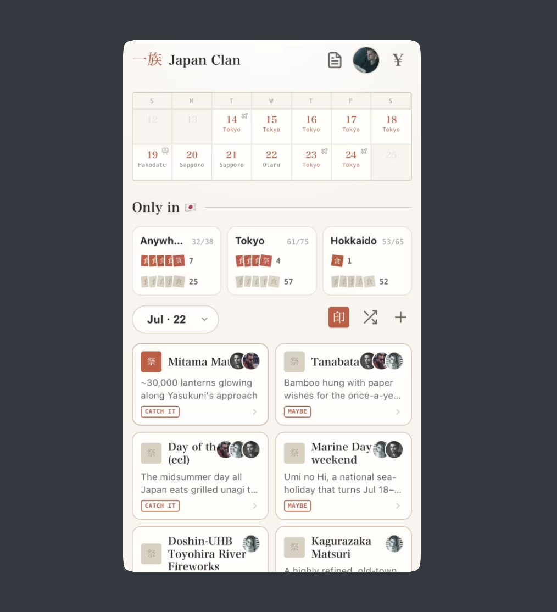
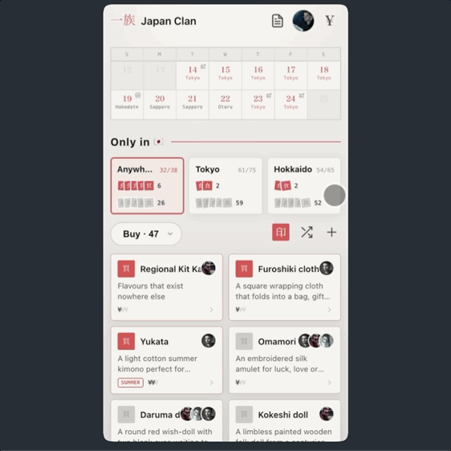
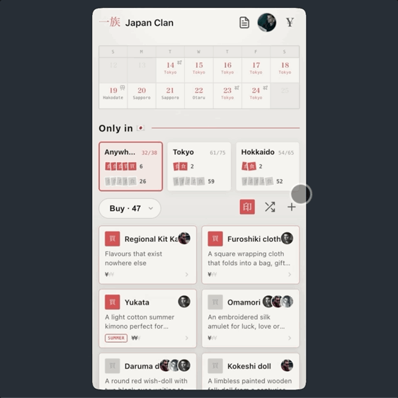
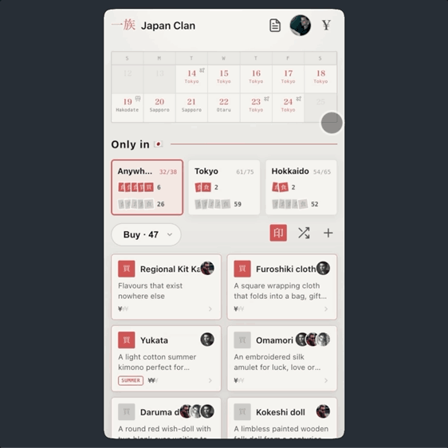
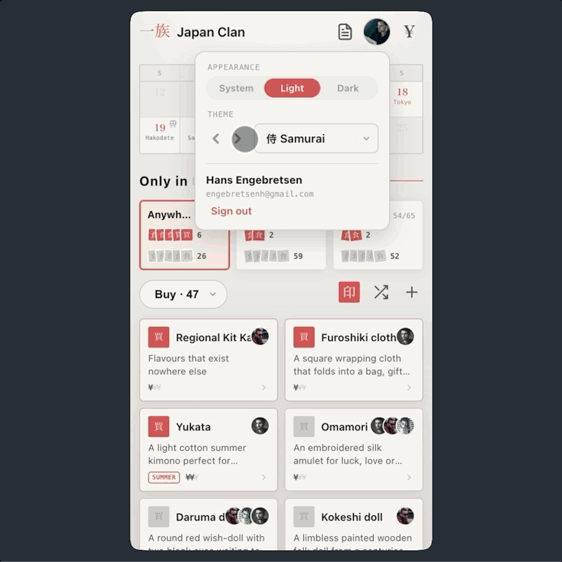

# `japanclan`

Organize travel details. View, pin and share fun unique things to do, eat or see. It's even a [progressive web app](demo/demo-pwa.mp4) that can be used offline. For more info on the app see [about.md](about.md).

  
[<kbd> haaans.com/japanclan  </kbd>](https://haaans.com/japanclan)

## Features

<table>
<tr valign="top">
<td width="50%">
<h3>Trip calendar</h3>

Organize by day, or view the whole schedule, with only the essential info. Details stored and protected by auth.

</td>
<td width="50%">

</td>
</tr>
<tr valign="top">
<td width="50%">

</td>
<td width="50%">
<h3>What should we do?</h3>

Pin & share, automatically categorized lists of unique-to-japan items.

</td>
</tr>
<tr valign="top">
<td width="50%">
<h3>Add your own</h3>

Whatever you want, to the list.

</td>
<td width="50%">

</td>
</tr>
<tr valign="top">
<td width="50%">

</td>
<td width="50%">
<h3>What does spencer owe Hans?</h3>

Ledger collects and calculates debts automatically. Oh yen conversion too.

</td>
</tr>
<tr valign="top">
<td width="50%">
<h3>All the colors</h3>

Def a vibe.

</td>
<td width="50%">

</td>
</tr>
</table>
